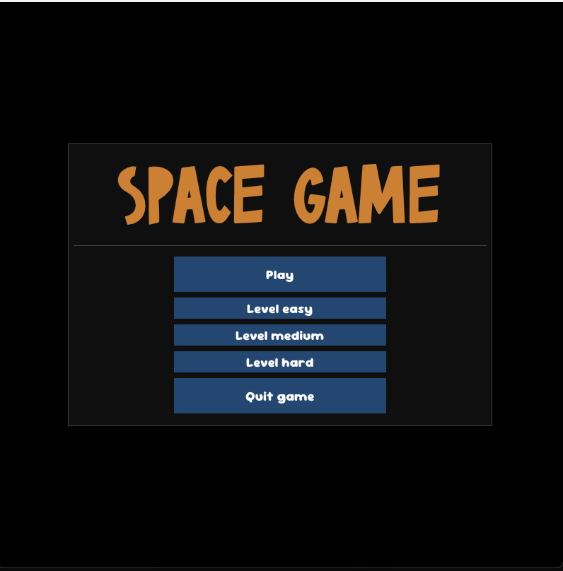
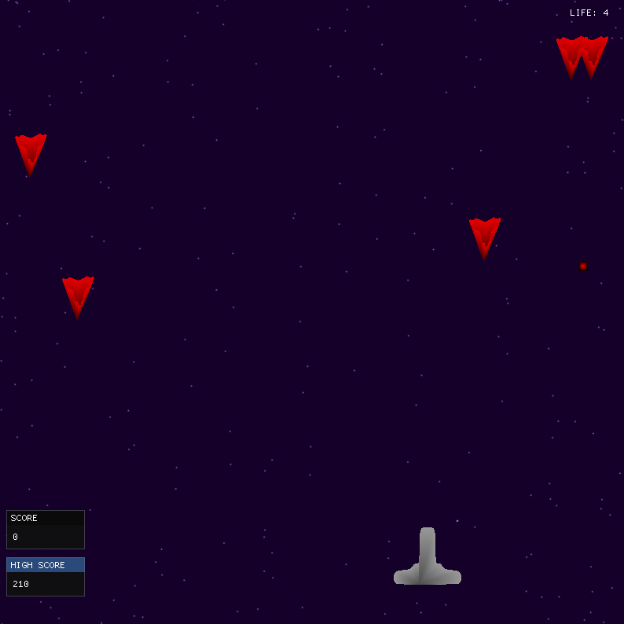
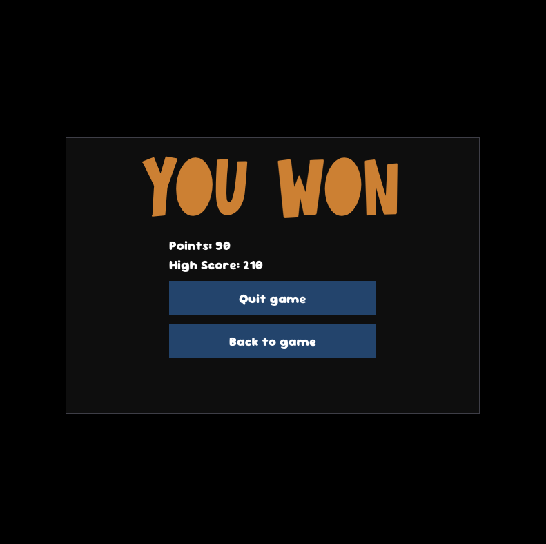
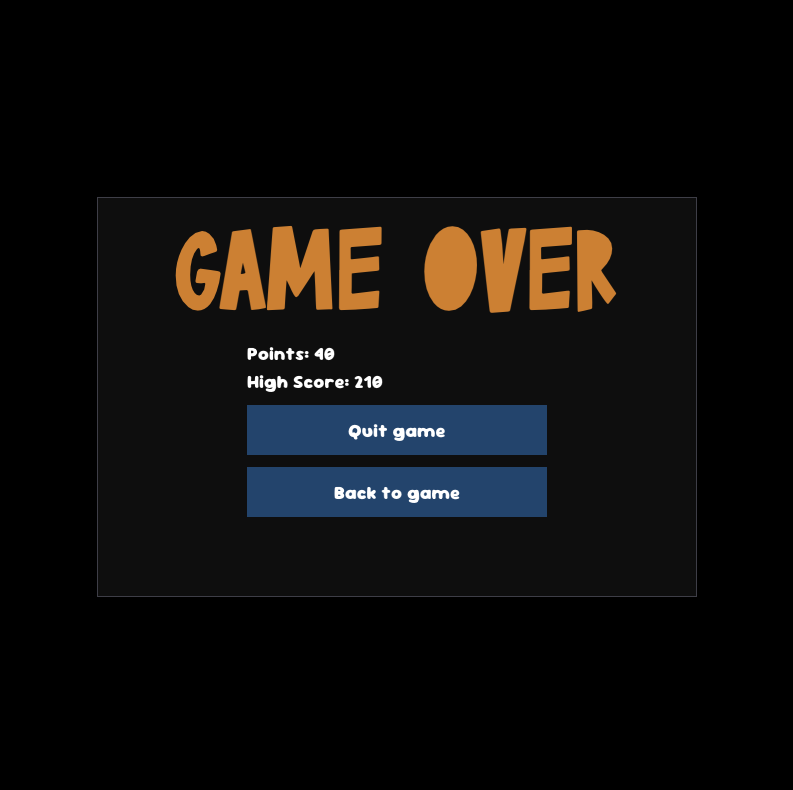

# Space Game 🚀

*Read this in [English](README.md).*

Un classico sparatutto arcade 2D ispirato a **Space Invaders**. Questo progetto è stato costruito da zero utilizzando **C++** e la libreria grafica **OpenGL** per gestire il rendering e la fisica di gioco.

## ⚠️ Disponibilità del Codice Sorgente

A causa di limitazioni sulla dimensione dei file (in particolare per gli asset e le librerie), non è stato possibile caricare l'intero codice sorgente e l'eseguibile direttamente in questa repository.

**Se sei interessato a visionare il codice o a provare il gioco, contattami direttamente!** Sarò felice di condividere i file del progetto attraverso un altro canale.

## 🛠️ Tecnologie Utilizzate

* **Linguaggio:** C++
* **Grafica:** OpenGL
* **Tipologia:** Arcade 2D

## 📸 Screenshots

  <b>Menu Principale</b> 
  

  <b>Fase di Gioco</b> 
  

  <b>Schermata Vittoria</b> 
  

  <b>Game Over</b> 
  

## 📬 Contatti

Per richiedere il codice sorgente, non esitare a scrivermi:

* 📩 **Email:** [sofialotti17@gmail.com]
* 💬 **Messaggio Diretto:** [github.com/sofialottii]
